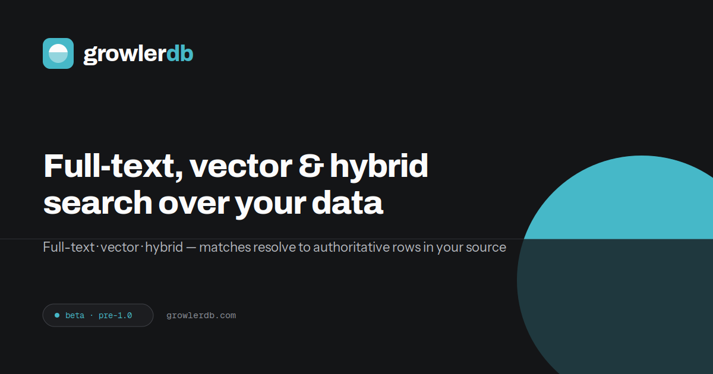

# GrowlerDB



**Search your lake. Keep one truth.** — open-source full-text search over Apache Iceberg (and other datastores).

[](https://github.com/GrowlerDB/growlerdb/actions/workflows/ci.yml)
[](LICENSE)
[](https://github.com/GrowlerDB/growlerdb/releases)

📖 **Documentation: <https://docs.growlerdb.com/>** — [Getting started](https://docs.growlerdb.com/getting-started) · [Install & run modes](https://docs.growlerdb.com/install) · [Configuration](https://docs.growlerdb.com/configuration) · [API reference](https://docs.growlerdb.com/reference)

GrowlerDB keeps Apache Iceberg as the system of record and maintains a fast, derived
full-text index of your Iceberg data. Search returns the matching **primary keys
(document coordinates)**, which resolve back to the authoritative rows in Iceberg.


> Status: **Beta** (0.x) — pre-1.0, production-tested, on the road to 1.0. The full surface —
> distributed search/hydration, AuthN/RBAC + tenant isolation, observability, the console UI, an
> OpenSearch-compatible `_search` adapter, and Compose + Helm deployment — is in place and tested
> (including backup/restore and single-shard replicas). Road to 1.0: a formal at-scale benchmark
> suite (directional numbers are already published — see [Performance](https://docs.growlerdb.com/performance)),
> full Polaris data-plane authz, and an external security review. See [docs/ga-criteria.md](docs/ga-criteria.md).

## Why GrowlerDB instead of Elasticsearch / OpenSearch?

- **No second copy of your data.** Your lakehouse stays the system of record; the index is a derived,
  rebuildable artifact — not a parallel datastore to provision, reconcile, and keep from drifting.
- **The lake is the source of truth.** A search returns **coordinates**; hydration returns the live,
  catalog-governed Iceberg row — not a search-time `_source` copy that goes stale.
- **No reindex-the-world migrations.** Point an index at a table and go; the changelog connector keeps
  it current from the Iceberg changelog. No `_bulk` re-load to stand up or re-shard.

And **vs. Trino / Spark full-text-on-Iceberg**: those scan the table (seconds at scale); GrowlerDB
answers from a real inverted index in **single-digit milliseconds** and hydrates only the matching rows
— [directional numbers](https://docs.growlerdb.com/performance) put it ~2–3× faster than Elasticsearch
on filtered search and ~50–170× faster than a Trino scan. See the full
[**comparison & positioning**](https://docs.growlerdb.com/comparison) page for when GrowlerDB is (and
isn't) the right fit.

## Architecture


GrowlerDB sits between your **Apache Iceberg** tables and your users. Iceberg stays the **system of
record**; GrowlerDB maintains a fast, derived full-text index and resolves matches back to the
authoritative rows.

**Ingest / write path** — ① your pipelines (Spark, Flink, streaming, batch ETL) land data in Iceberg
· ② the **Connector** (Spark Structured Streaming) reads the Iceberg changelog · ③ it streams
document batches over gRPC to **index nodes**, which build local **Tantivy** segments with a **redb**
locator (key → `(file, row position)`).

**Query / read path** — ④ a client (Console, SDK, or the OpenSearch `_search` adapter) calls the
**Gateway** · ⑤ the Gateway scatter-gathers across shard **nodes** and merges the top-K into ranked
**document coordinates** (primary keys) · ⑥ `keys:get` **hydrates** those coordinates to authoritative
rows via targeted point-reads back from Iceberg · ⑦ merged, hydrated results return to the client.

The **Control Plane** is the routing source of truth (nodes register; the Gateway resolves shards),
and every service emits **OpenTelemetry** to the bundled **LGTM** stack (Grafana · Prometheus · Loki ·
Tempo). Editable diagram source: [`docs/img/architecture.excalidraw`](docs/img/architecture.excalidraw).

## Features

- **Search over Iceberg** — index a source table; search returns coordinates that **hydrate to
  authoritative rows from Iceberg** (`/v1/search` → `/v1/keys:get`).
- **Query language** — native structured AST + a Lucene/KQL string parser.
- **Distributed** — control plane (registry), stateful searcher/index nodes, and a scatter-gather
  Gateway; hash/partition sharding.
- **Secure & multi-tenant** — OIDC/JWT + API keys + mTLS; control-plane RBAC; non-widenable tenant
  scoping verified end-to-end.
- **Observable** — OpenTelemetry traces/metrics/logs, Prometheus, and bundled Grafana SLI dashboards.
- **Console UI** — Search, Indexes, Ingestion, and Observability, served by the Gateway.
- **Ecosystem** — an optional [OpenSearch `_search` adapter](docs/opensearch-adapter.md).

## Repository layout

```
crates/
  growlerdb-core         shared types, traits, errors, the query AST + parser
  growlerdb-index        index store (Tantivy segments + redb locator) + Index API
  growlerdb-engine       search execution, hydration, auth, gateway, REST/OpenSearch surfaces
  growlerdb-controlplane the cluster index registry
  growlerdb-source       Iceberg source reader (Polaris/REST catalog)
  growlerdb-telemetry    OpenTelemetry + Prometheus + health probes
  growlerdb-proto        gRPC wire schema (growlerdb.v1) + the growlerdb-core bridge
  growlerdb-cli          the `growlerdb` CLI (embedded · serve · gateway · control-plane)
  growlerdb-client       Rust client library
ui/             the Svelte console (served by the Gateway)
connector/      JVM Spark ingestion connector (separate Maven build; not a cargo member)
connector-trino/  Trino plugin — a `search` table function (query→keys+score) to JOIN in SQL (experimental)
deploy/compose  local dev/test stack (MinIO + Polaris + LGTM)
deploy/helm     Helm chart (Kubernetes sharded-cluster topology)
docs/           user documentation (GitHub Pages site, built from this folder)
```

## Try it (one command)

Bring up the **whole stack** (GrowlerDB + MinIO + Polaris + LGTM), which seeds a sample
`growlerdb.docs` table, builds + serves an index over it, and opens the console:

```sh
just stack          # build + start everything (needs Docker + just); ~10 min on first build
```

Open the console at **<http://localhost:8081>**, sign in with **`demo` / `demo`**, and search from
the UI.

Prefer the API? The demo runs with built-in auth, so log in for a session token, then search the
seeded `docs` index (results are **coordinates**, which hydrate to the authoritative rows in
Iceberg):

```sh
token=$(curl -s localhost:8081/v1/login -H 'content-type: application/json' \
  -d '{"username":"demo","password":"demo"}' | jq -r .token)

curl -s localhost:8081/v1/search -H "authorization: Bearer $token" \
  -H 'content-type: application/json' \
  -d '{"index":"docs","query":"title:iceberg","limit":5}'
```

Tear it all down with `just stack-down`.

👉 Full walkthrough (first search → hydrate → console → OpenSearch adapter):
**[getting-started tutorial](https://docs.growlerdb.com/getting-started)**.

## Develop

The Rust toolchain is managed by [mise](https://mise.jdx.dev). With mise installed:

```sh
mise install            # install the pinned Rust toolchain
just setup              # add rustfmt + clippy components
just build              # build the workspace
just check              # fmt + clippy + tests (what CI runs)
just up                 # start local dev deps (MinIO + Polaris) only
just run -- --help      # run the growlerdb CLI
```

## Documentation

Full docs are the **GitHub Pages site at <https://docs.growlerdb.com/>** (built from
[`docs/`](docs/)):

- [Getting started](https://docs.growlerdb.com/getting-started) — zero to first search.
- [Install & run modes](https://docs.growlerdb.com/install) · [Configuration](https://docs.growlerdb.com/configuration) · [API & query reference](https://docs.growlerdb.com/reference)
- [Why GrowlerDB — comparison & positioning](https://docs.growlerdb.com/comparison) · [Performance (directional)](https://docs.growlerdb.com/performance) — vs Elasticsearch & Trino.
- [Migrating from Elasticsearch/OpenSearch](https://docs.growlerdb.com/migration-from-elasticsearch) · [Deployment](https://docs.growlerdb.com/deployment) · [Roadmap & known limitations](https://docs.growlerdb.com/roadmap) · [GA criteria](https://docs.growlerdb.com/ga-criteria)
- [Security policy](SECURITY.md) · [Releasing](RELEASING.md) · [Changelog](CHANGELOG.md) · [Brand guidelines](BRAND.md)

## Open source & commercial

GrowlerDB is **open core**. The full engine — distributed search/hydration, AuthN/RBAC, the console,
and everything in this repo — is **open source under AGPL-3.0**, free for internal and self-hosted
production use up to the **open-source scale limit** (currently **3 nodes**). No sign-up, no
phone-home: entitlements are verified offline.

A **[commercial license](COMM-LICENSE.md)** from **GrowlerDB LLC** covers the cases the AGPL doesn't:

- **Scale** — operating **beyond the open-source node limit**.
- **Embedding / OEM** — shipping GrowlerDB inside a proprietary product or SaaS without AGPL copyleft.
- **AGPL-incompatible use** — when your organization's policy can't take AGPL.
- **Enterprise add-ons** — SSO/SAML/SCIM, audit logging, advanced HA (cross-region DR), and managed
  multi-tenancy, distributed separately from this AGPL core.

Beyond the limit, the cluster keeps running — existing nodes re-register normally; only *new*
capacity is gated. See the console's **Settings → Enterprise license** for current usage.

**📬 Talk to us** — for commercial/OEM licensing, enterprise features, or operating at scale, email
**[support@growlerdb.com](mailto:support@growlerdb.com)** with your use case and we'll scope the right
agreement. (Pricing isn't public yet — reach out and we'll work it out with you.)

## License & contributing

AGPL-3.0-only (see [LICENSE](LICENSE)); a [commercial license](COMM-LICENSE.md) is available as
described above. Contributions are under a **license-grant [CLA](CLA.md)** — see
[CONTRIBUTING.md](CONTRIBUTING.md) and the [Code of Conduct](CODE_OF_CONDUCT.md).
