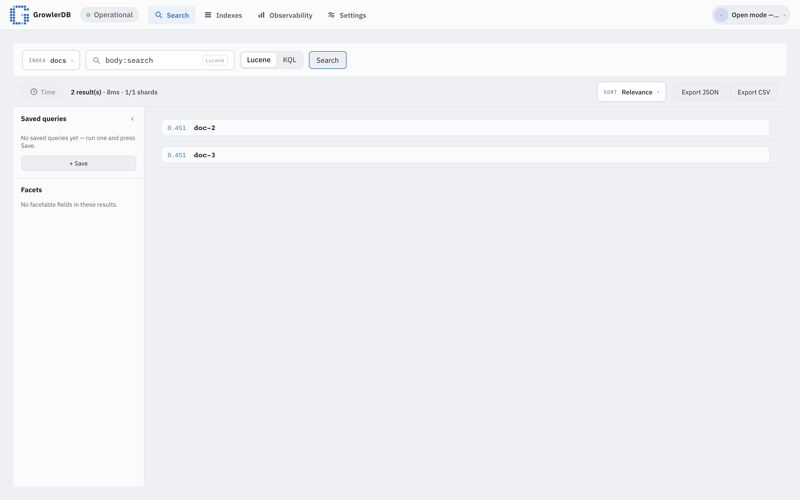

# GrowlerDB

```
                                              06303                         63696  9693
                                                 66       66                    09    06
   6630309  90 396996 3093609  00333 6603 66639  33    663  39  960369339 90000996    33060963
   03   03    60      39   36    66  0 96  90    39    66969993   39     033    06    69    66
   33  0      36      93   33     9  3  6  6     63    93         60     909    33    33    99
   9936603  390669    3369930     6003  9903    36006  60990966 990096    6930933690  6009096
  39     36
  06963336
```

**Open-source text search engine over Apache Iceberg** (and other datastores).

[](https://github.com/GrowlerDB/growlerdb/actions/workflows/ci.yml)
[](LICENSE)
[](https://github.com/GrowlerDB/growlerdb/releases)

📖 **Documentation: <https://growlerdb.github.io/growlerdb/>** — [Getting started](https://growlerdb.github.io/growlerdb/getting-started) · [Install & run modes](https://growlerdb.github.io/growlerdb/install) · [Configuration](https://growlerdb.github.io/growlerdb/configuration) · [API reference](https://growlerdb.github.io/growlerdb/reference)

GrowlerDB keeps Apache Iceberg as the system of record and maintains a fast, derived
full-text index of your Iceberg data. Search returns the matching **primary keys
(document coordinates)**, which resolve back to the authoritative rows in Iceberg.



> Status: **GA line** (0.x). The full surface — distributed search/hydration, AuthN/RBAC +
> tenant isolation, observability, the console UI, an OpenSearch-compatible `_search` adapter, and
> Compose + Helm deployment — is in place and tested. Road to 1.0: performance benchmarking,
> backup/restore + replica segment-shipping, and an external security review. See
> [docs/ga-criteria.md](docs/ga-criteria.md).

## Architecture


GrowlerDB sits between your **Apache Iceberg** tables and your users. Iceberg stays the **system of
record**; GrowlerDB maintains a fast, derived full-text index and resolves matches back to the
authoritative rows.

**Ingest / write path** — ① your pipelines (Spark, Flink, streaming, batch ETL) land data in Iceberg
· ② the **Connector** (Spark Structured Streaming) reads the Iceberg changelog · ③ it streams
document batches over gRPC to **index nodes**, which build local **Tantivy** segments with a **redb**
locator (key → `(file, row position)`).

**Query / read path** — ④ a client (Console, SDK, or the OpenSearch `_search` adapter) calls the
**Gateway** · ⑤ the Gateway scatter-gathers across shard **nodes** and merges the top-K into ranked
**document coordinates** (primary keys) · ⑥ `keys:get` **hydrates** those coordinates to authoritative
rows via targeted point-reads back from Iceberg · ⑦ merged, hydrated results return to the client.

The **Control Plane** is the routing source of truth (nodes register; the Gateway resolves shards),
and every service emits **OpenTelemetry** to the bundled **LGTM** stack (Grafana · Prometheus · Loki ·
Tempo). Editable diagram source: [`docs/img/architecture.excalidraw`](docs/img/architecture.excalidraw).

## Features

- **Search over Iceberg** — index a source table; search returns document keys that **hydrate to
  authoritative rows from Iceberg** (`/v1/search` → `/v1/keys:get`).
- **Query language** — native structured AST + a Lucene/KQL string parser.
- **Distributed** — control plane (registry), stateful searcher/index nodes, and a scatter-gather
  Gateway; hash/partition sharding.
- **Secure & multi-tenant** — OIDC/JWT + API keys + mTLS; control-plane RBAC; non-widenable tenant
  scoping verified end-to-end.
- **Observable** — OpenTelemetry traces/metrics/logs, Prometheus, and bundled Grafana SLI dashboards.
- **Console UI** — Search, Indexes, Ingestion, and Observability, served by the Gateway.
- **Ecosystem** — an optional [OpenSearch `_search` adapter](docs/opensearch-adapter.md).

## Repository layout

```
crates/
  growlerdb-core         shared types, traits, errors, the query AST + parser
  growlerdb-index        index store (Tantivy segments + redb locator) + Index API
  growlerdb-engine       search execution, hydration, auth, gateway, REST/OpenSearch surfaces
  growlerdb-controlplane the cluster index registry
  growlerdb-source       Iceberg source reader (Polaris/REST catalog)
  growlerdb-telemetry    OpenTelemetry + Prometheus + health probes
  growlerdb-proto        gRPC wire schema (growlerdb.v1) + the growlerdb-core bridge
  growlerdb-cli          the `growlerdb` CLI (embedded · serve · gateway · control-plane)
  growlerdb-client       Rust client library
ui/             the Svelte console (served by the Gateway)
connector/      JVM Spark ingestion connector (separate Maven build; not a cargo member)
deploy/compose  local dev/test stack (MinIO + Polaris + LGTM)
deploy/helm     Helm chart (Kubernetes sharded-cluster topology)
docs/           user documentation (GitHub Pages site, built from this folder)
```

## Try it (one command)

Bring up the **whole stack** (GrowlerDB + MinIO + Polaris + LGTM), which seeds a sample
`growlerdb.docs` table, builds + serves an index over it, and opens the console:

```sh
just stack          # build + start everything (needs Docker + just); ~10 min on first build
```

Open the console at **<http://localhost:8081>**, sign in with **`demo` / `demo`**, and search from
the UI.

Prefer the API? The demo runs with built-in auth, so log in for a session token, then search the
seeded `docs` index (results are **document keys**, which hydrate to the authoritative rows in
Iceberg):

```sh
token=$(curl -s localhost:8081/v1/login -H 'content-type: application/json' \
  -d '{"username":"demo","password":"demo"}' | jq -r .token)

curl -s localhost:8081/v1/search -H "authorization: Bearer $token" \
  -H 'content-type: application/json' \
  -d '{"index":"docs","query":"title:iceberg","limit":5}'
```

Tear it all down with `just stack-down`.

👉 Full walkthrough (first search → hydrate → console → OpenSearch adapter):
**[getting-started tutorial](https://growlerdb.github.io/growlerdb/getting-started)**.

## Develop

The Rust toolchain is managed by [mise](https://mise.jdx.dev). With mise installed:

```sh
mise install            # install the pinned Rust toolchain
just setup              # add rustfmt + clippy components
just build              # build the workspace
just check              # fmt + clippy + tests (what CI runs)
just up                 # start local dev deps (MinIO + Polaris) only
just run -- --help      # run the growlerdb CLI
```

## Documentation

Full docs are the **GitHub Pages site at <https://growlerdb.github.io/growlerdb/>** (built from
[`docs/`](docs/)):

- [Getting started](https://growlerdb.github.io/growlerdb/getting-started) — zero to first search.
- [Install & run modes](https://growlerdb.github.io/growlerdb/install) · [Configuration](https://growlerdb.github.io/growlerdb/configuration) · [API & query reference](https://growlerdb.github.io/growlerdb/reference)
- [Migrating from Elasticsearch/OpenSearch](https://growlerdb.github.io/growlerdb/migration-from-elasticsearch) · [Deployment](https://growlerdb.github.io/growlerdb/deployment) · [Roadmap & known limitations](https://growlerdb.github.io/growlerdb/roadmap) · [GA criteria](https://growlerdb.github.io/growlerdb/ga-criteria)
- [Security policy](SECURITY.md) · [Releasing](RELEASING.md) · [Changelog](CHANGELOG.md)

## License & contributing

Apache-2.0 (see [LICENSE](LICENSE)). Contributions are by **DCO sign-off** —
see [CONTRIBUTING.md](CONTRIBUTING.md) and the [Code of Conduct](CODE_OF_CONDUCT.md).
