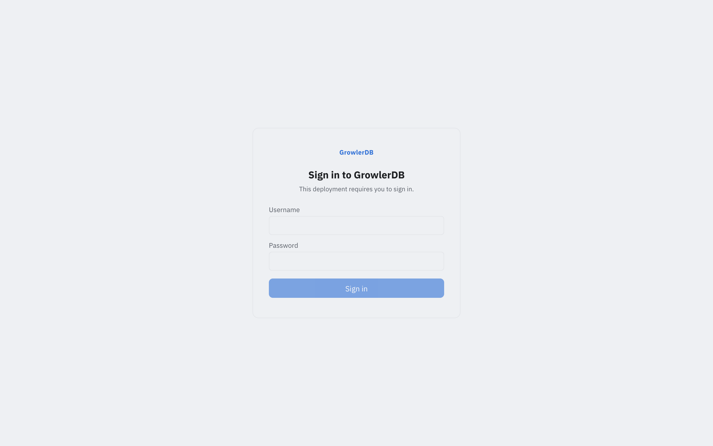
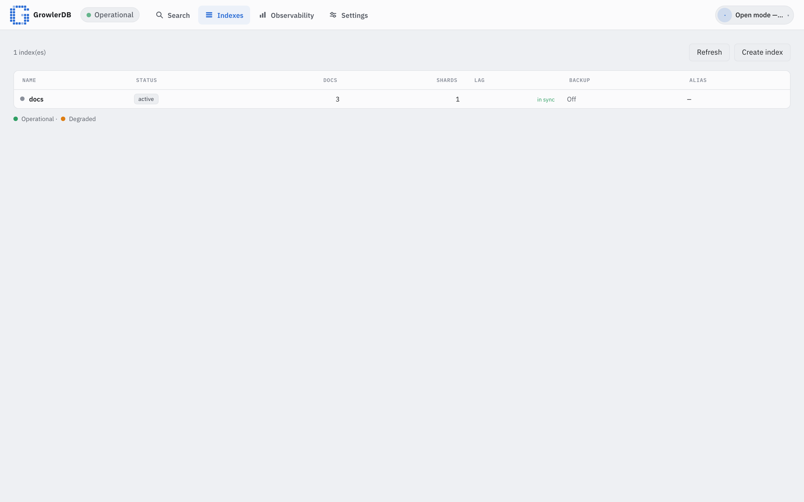
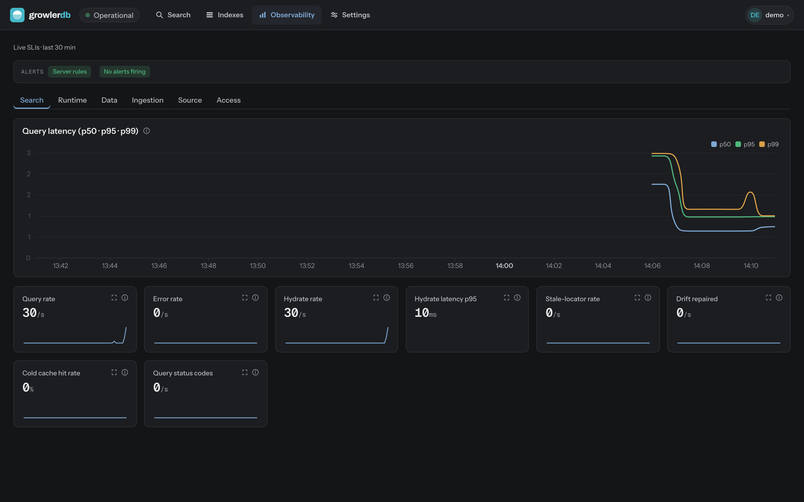

# Getting started

This tutorial takes you from nothing to your **first search** against a real Iceberg table, using
the local Compose stack (GrowlerDB + MinIO object storage + Apache Polaris catalog + the LGTM
observability stack). Time: ~10 minutes, mostly the first image build.

## Prerequisites

You need **Docker with the Compose v2 plugin**, **[`just`](https://github.com/casey/just)**, and
**`jq`** (the REST examples pipe JSON through it). The **core walkthrough (§1–§10) runs entirely in
containers** — no language toolchains required. The **streaming demo (§11)** is the one exception: it
builds the Spark connector jar on the host, which needs **[`mise`](https://mise.jdx.dev)** (it
provisions JDK 21 + Maven on demand) — installed in §11, not needed before then. Run it on a **Linux
host or a VM, or macOS with Docker Desktop** — *not* inside a container (Docker bind mounts won't
resolve there). **~4 GB RAM** is enough.

### Ubuntu / Debian

```sh
sudo apt-get update
sudo apt-get install -y docker.io docker-compose-v2 docker-buildx just jq git curl
sudo systemctl enable --now docker
# optional: run docker without sudo (log out/in afterwards)
sudo usermod -aG docker "$USER"
```

### macOS

```sh
brew install --cask docker   # Docker Desktop — bundles Compose v2 + buildx; launch it once
brew install just jq
```

### Then, on either OS — one `/etc/hosts` entry

So the `curl` hydration calls *you* run on the host can reach the in-container object storage by the
name the stored file paths use:

```sh
echo "127.0.0.1 minio" | sudo tee -a /etc/hosts
```

(The console doesn't need this — it talks to the gateway, which reaches MinIO inside the Compose
network. It's only for host-side hydration.)

## 1. Bring up the full stack

From the repo root:

```sh
just stack
```

This builds the GrowlerDB image, brings up MinIO + Polaris, **seeds two sample Iceberg tables** —
`growlerdb.docs` (3 rows) and the richer `growlerdb.catalog` (10 rows) — then starts the control
plane, **two nodes**, the gateway, and Grafana/LGTM. One node builds the `docs` index, the other the
`catalog` index; both serve and register with the control plane, and the single `--all-indexes`
gateway routes each request to its named index (multi-index routing).

> **First run also fetches the local embedding model.** `just stack` provisions **bge-small-en-v1.5**
> (~130 MB) once into `${GROWLERDB_MODEL_DIR:-~/.cache/growlerdb/models}` on the host and reuses it on
> every later run (and from host `cargo test`/eval). It's what powers the semantic + hybrid search and
> the **Ask** screen (§6–§7): embedding runs **in-process** (Candle), **fully local, no API key**.
> Point `GROWLERDB_MODEL_DIR` elsewhere to relocate the cache.

When it settles, the **console** is at <http://localhost:8081> and Grafana at <http://localhost:3000>.

> **Two indexes now, so every request names one.** With more than one index served, the gateway can't
> guess a default: search / `keys:get` requests must include `"index":"docs"` or `"index":"catalog"`,
> and the console's top-left selector switches between them. (Omitting `index` returns
> `index required; endpoint serves 2 indexes`.)

## 2. Log in

The demo runs **authenticated** (not open) so you can see GrowlerDB's built-in login and per-index
access control. Open <http://localhost:8081> and you'll get a **login form** — sign in with the
baked-in demo credential:

| Field | Value |
|---|---|
| Username | `demo` |
| Password | `demo` |



The `demo` user has the **reader + operator** roles (query + read index metadata; it can't create,
drop, or ingest) and is **scoped to the `docs` and `catalog` indexes** — a token issued to it can only
touch those two (per-index RBAC). Sign-in mints a short-lived session token the gateway validates on
every request.

> A deliberately well-known **demo credential** — not a production account (change it via the demo
> auth env in `deploy/compose/docker-compose.yml`).

To call the REST API you need that token. Fetch one from the (unauthenticated) login endpoint and keep
it in a shell variable — the `curl` examples below send it as `-H "authorization: Bearer $TOKEN"`:

```sh
TOKEN=$(curl -s localhost:8081/v1/login -H 'content-type: application/json' \
  -d '{"username":"demo","password":"demo"}' | jq -r .token)
```

## 3. Your first search (REST)

The gateway serves the Engine API at `:8081`. Search returns ranked **document coordinates**:

```sh
curl -s localhost:8081/v1/search \
  -H 'content-type: application/json' \
  -H "authorization: Bearer $TOKEN" \
  -d '{"index":"docs","query":"title:iceberg","limit":5}'
```

You get the matching keys + scores — no row contents, just the **coordinates**:

```json
{
  "hits": [
    { "coordinates": { "identifier": [{ "name": "id", "value": "doc-2" }] }, "score": 0.814 }
  ],
  "total": 1, "shards_scanned": 1, "shards_total": 1
}
```

Now hydrate the authoritative row from Iceberg by that key:

```sh
curl -s localhost:8081/v1/keys:get \
  -H 'content-type: application/json' \
  -H "authorization: Bearer $TOKEN" \
  -d '{"index":"docs","keys":[{"identifier":[{"name":"id","value":"doc-2"}]}]}'
```

```json
{
  "rows": [
    { "key": { "identifier": [{ "name": "id", "value": "doc-2" }] },
      "fields": { "id": "doc-2", "title": "iceberg search",
                  "body": "fast full text search over apache iceberg" } }
  ]
}
```

That round-trip — **search returns coordinates, which hydrate to rows from the lake** — is the core of
GrowlerDB.

## 4. Explore in the console

Open <http://localhost:8081>. Pick the **`catalog`** index in the top-left selector, type a query like
`category:(guide OR reference)`, and hit **Search**. Results are a **datatable** — one row per hit
with its **cached fields as columns** (author, category, rating, title, views) — no drawer round-trip,
matched terms highlighted per cell:


> **Tip:** the top-left selector now switches between the **`docs`** and **`catalog`** indexes — pick
> the one you want to query. In the console's Lucene box a bare word (`search`) queries that index's
> *default* field — qualify it with a field, e.g. `body:search` or `title:iceberg`, to match. Click a
> hit to hydrate the full row in the drawer.

- **Search & Explore** — run queries, inspect hits, hydrate rows in the drawer, export JSON/CSV.
- **Indexes** — every index with docs / shards / sync lag / backup state; **Create index** points at
  a source table and introspects its schema:

  

- **Observability** — native SLI panels (query rate/errors/latency, hydration, ingestion lag) with a
  health roll-up; the **Ingestion** tab shows per-index source-head vs. committed-checkpoint lag:

  

## 5. Query playground (the `catalog` index)

The second seeded index, **`catalog`**, is a 10-row catalog of GrowlerDB concepts with a field of
every type — text (`title`, `body`), keyword (`id`, `category`, `author`), numeric (`views` LONG,
`rating` DOUBLE), a `published` DATE, a `server_ip` IP, and an `archived` BOOL. It's built for
trying out the [query language](reference): every operator below returns a small, known result.

Because two indexes are served, **name the index in every request**:

```sh
curl -s localhost:8081/v1/search \
  -H 'content-type: application/json' \
  -H "authorization: Bearer $TOKEN" \
  -d '{"index":"catalog","query":"body:hydrate","limit":10}'
```

That returns the two rows whose `body` mentions *hydrate* — `cat-02` and `cat-07`.

### Lucene operators

Each row below is a `query` you can drop into the request above (`{"index":"catalog","query":"…","limit":10}`).
The **hits** column lists the exact `id`s expected against the seed data.

| # | Operator | `query` | Expected hits (`id`) |
|---|----------|---------|----------------------|
| 1 | Term (field) | `body:iceberg` | cat-01, cat-03 |
| 2 | Default-field term (bare word → `body`) | `hydrate` | cat-02, cat-07 |
| 3 | Phrase | `body:"system of record"` | cat-03 |
| 4 | Keyword term (exact) | `category:reference` | cat-02, cat-05, cat-06 |
| 5 | Set / OR (grouped) | `category:(guide OR reference)` | cat-01, cat-02, cat-05, cat-06, cat-10 |
| 6 | Numeric range (LONG, open upper) | `views:[2000 TO *]` | cat-01, cat-02, cat-05, cat-10 |
| 7 | Float range (DOUBLE, exclusive) | `rating:{4.5 TO 5.0}` | cat-01, cat-02, cat-07, cat-10 |
| 8 | Date range (ISO-date bounds) | `published:[2024-01-01 TO *]` | cat-01, cat-02, cat-04, cat-05, cat-09, cat-10 |
| 9 | CIDR (IP field) | `server_ip:10.0.0.0/8` | cat-01, cat-02, cat-04, cat-06, cat-08, cat-10 |
| 10 | Wildcard | `author:ca*` | cat-03, cat-07, cat-09 (author `carol`) |
| 11 | Prefix (`category:ref*`) | `category:ref*` | cat-02, cat-05, cat-06 |
| 12 | Fuzzy (edit distance 1) | `body:hydrat~1` | cat-02, cat-07 (matches `hydrate`) |
| 13 | Boost (ranking only) | `body:search^2 OR body:iceberg` | cat-01, cat-02, cat-03, cat-07 (search-matching rows ranked higher) |
| 14 | BOOL term | `archived:true` | cat-03, cat-06, cat-08 |
| 15 | NOT / `-` | `-archived:true` | the other 7: cat-01, cat-02, cat-04, cat-05, cat-07, cat-09, cat-10 |
| 16 | Match-all | `*:*` | all 10 rows |
| 17 | Regex (KEYWORD `id`) | `id:/cat-0[12]/` | cat-01, cat-02 |

A few notes:

- **#2 default field.** A bare term queries `body` because `body` is the first TEXT field in the
  `catalog` mapping (the engine's default search field is the first analyzed text field). `title` is
  also TEXT but must be qualified (`title:reference` → cat-02, cat-06).
- **#5 grouped set and #7 exclusive range.** `category:(guide OR reference)` groups two terms on one
  field — the same match set as writing `category:guide OR category:reference` out in full. `{ }` is
  exclusive, `[ ]` inclusive — mix them per bound, e.g. `views:[1000 TO 2000]` → cat-03, cat-07.
- **#9 CIDR.** `server_ip:192.168.1.0/24` narrows to cat-03, cat-05; `192.168.0.0/16` → cat-03,
  cat-05, cat-07, cat-09. The IP field is explicit-only in the mapping (Iceberg has no IP type).
- **#12 fuzzy / #13 boost.** Boost changes only the score, not the match set. Fuzzy `~1` allows one
  edit; `hydrat~1` still reaches `hydrate`.
- **#8 dates.** `published` is a DATE field, so range bounds accept an **ISO-8601 date string**
  (`2024-01-01`) *or* the equivalent epoch-**microseconds** (`1704067200000000`) — both resolve to the
  same canonical instant, so `published:[2024-01-01 TO *]` and `published:[1704067200000000 TO *]`
  return the same rows.
- **#14 BOOL / #15 NOT.** `archived:true` matches the three archived rows; the negation `-archived:true`
  (≡ `NOT archived:true`) returns the other seven. `-` and `NOT` are equivalent.

### KQL

Send `"syntax":"kql"` to use **KQL** instead of Lucene — the difference is lowercase `and` / `or` /
`not` operators (field/range/`*` syntax is the same):

```sh
curl -s localhost:8081/v1/search \
  -H 'content-type: application/json' \
  -H "authorization: Bearer $TOKEN" \
  -d '{"index":"catalog","syntax":"kql","query":"category:guide or category:adr","limit":10}'
```

→ cat-01, cat-09, cat-10 (same as the Lucene `category:guide OR category:adr`). Likewise
`author:carol and not category:concept` → cat-09.

### Sort by a fast field

`views`, `rating`, and `published` are **fast fields** (columnar) — sort, range, and aggregation use
them. Sort by one instead of relevance:

```sh
curl -s localhost:8081/v1/search \
  -H 'content-type: application/json' \
  -H "authorization: Bearer $TOKEN" \
  -d '{"index":"catalog","query":"*:*","sort":[{"field":"views","desc":true}],"limit":3}'
```

→ the three most-viewed: `cat-01` (4800), `cat-02` (3200), `cat-10` (2750).

In the **console**, each result row shows the index's `cached` fields (here title, category, author,
rating, views) inline to the right of the primary key — lighter font, with your query terms
highlighted — so the valuable data is visible without opening the detail drawer.

## 6. Semantic & hybrid search

The `catalog` index carries one field the playground above didn't use: **`body_vec`**, a `VECTOR`
field. At ingest, GrowlerDB embeds each row's `body` text with the local **bge-small-en-v1.5** model
(via Candle, in-process) and stores the 384-dim vector — so `catalog` also supports **semantic**
(nearest-neighbour) and **hybrid** (lexical + semantic, fused) retrieval alongside the Lucene/KQL
queries above. It's **fully local**: the model is the one `just stack` fetched in §1 — no embedding
service, no API key.

**Semantic search** embeds your `query_text` the same way and returns the `k` nearest rows, matching
on *meaning* — so a paraphrase with no shared keywords still hits. The two hydration rows (`cat-02`,
`cat-07`) say "hydrate", never "fetch the original record":

```sh
curl -s localhost:8081/v1/search:semantic \
  -H 'content-type: application/json' \
  -H "authorization: Bearer $TOKEN" \
  -d '{"index":"catalog","vector_field":"body_vec","query_text":"how do I fetch the original record after a query","k":5}'
```

Like `/v1/search`, it returns ranked **coordinates** (with any `cached` fields) — hydrate them with
`keys:get` exactly as in section 3. A lexical `body:"fetch the original record"` matches nothing,
while the semantic arm ranks the hydration rows at the top.

**Hybrid search** runs a lexical (BM25) *and* a semantic arm over the same `query_text` and
Reciprocal-Rank-Fuses them, so exact keyword hits and semantic near-matches both surface (tune the
fusion constant with `rrf_k`):

```sh
curl -s localhost:8081/v1/search:hybrid \
  -H 'content-type: application/json' \
  -H "authorization: Bearer $TOKEN" \
  -d '{"index":"catalog","vector_field":"body_vec","query_text":"restoring authoritative rows from the lakehouse","k":5}'
```

In the **console**, open the **Search** screen over the `catalog` index: a **Lexical / Semantic /
Hybrid** mode selector appears (it shows only for an index with a `VECTOR` field) — pick a mode and
query from the same box. The **Ask** screen goes further: pose a natural-language question over
`catalog` and it hybrid-retrieves the matching source passages, each shown with a **citation** back to
its exact Iceberg coordinates. GrowlerDB does the *retrieval* and returns governed coordinates +
citations — **it never calls an LLM**; generating a prose answer is the caller's job (see §7).

> **Want retrieval quality you can feel?** Ten rows can't show ranking. `just demo-data` loads the
> opt-in **arXiv corpus** — ~20k CS abstracts, embedded locally — where semantic vs lexical vs
> hybrid visibly differ and agent Q&A (§7) has real substance. See
> [Demo corpus (arXiv)](demo-corpus).

## 7. Connect an AI agent (MCP)

GrowlerDB is an **MCP server** (Model Context Protocol), so an AI agent can use the demo as a
**retrieval tool** — grounded, governed search over your Iceberg data with no bespoke glue. The
gateway serves the MCP **Streamable HTTP transport** at `POST /mcp` on the same port as the console
and **verifies the caller's bearer token** on every tool call, so the token's **tenant + per-index
RBAC scoping still applies**: the agent only ever sees what `demo` may see.

With the stack up, one command prints everything you need:

```sh
just mcp-connect
```

It mints a demo token and prints paste-ready snippets: the **Claude Code** one-liner
(`claude mcp add --transport http growlerdb http://localhost:8081/mcp --header "Authorization: Bearer <token>"`),
a generic HTTP-MCP config block for any client, and a **Claude Desktop** bridge. No binary to
install, no subprocess to manage — it's a URL and a token. (Tokens expire; re-run to re-mint.)

**Claude Code auto-discovers the demo server** via the repo's checked-in `.mcp.json`: export the
token the script prints —

```sh
export GROWLERDB_DEMO_TOKEN=<token>   # printed by `just mcp-connect`
```

— then start `claude` anywhere in this repo and approve the `growlerdb-demo` server when prompted.
Without the export the server fails **silently** (no growlerdb tools in the session — the agent will
fall back to grepping files); verify with `/mcp` inside the session. And when a token expires, note
`claude mcp add` won't overwrite an existing server — `claude mcp remove growlerdb` first (the
`just mcp-connect` snippet does this for you).

Now ask the agent something the demo data answers — *"what does the catalog say about hydration?"* —
and it retrieves from `catalog` (semantic, hybrid, and lexical; `search` even hydrates authoritative
rows in the same call with `hydrate: true`), grounded by **governed coordinates + citations** scoped
by the demo token's RBAC. As everywhere else, **GrowlerDB never calls an LLM**: it returns the
retrieved, access-controlled source rows and *the agent* composes the answer from them. Retrieval
with citations is the product; the model stays yours.

> A **stdio** transport (`growlerdb mcp`) also exists for environments where the agent can't reach
> the gateway over HTTP — see the
> [MCP interface reference](https://github.com/GrowlerDB/growlerdb/blob/main/okf/product/interfaces/mcp-server.md)
> and `growlerdb mcp --help`.

## 8. Use the OpenSearch adapter (optional)

The stack enables the [OpenSearch-compatible adapter](opensearch-adapter), so OpenSearch clients
work against the same data:

```sh
curl -s localhost:8081/docs/_search \
  -H 'content-type: application/json' \
  -H "authorization: Bearer $TOKEN" \
  -d '{"query":{"match":{"body":"search"}},"size":5}'
```

You get OpenSearch-shaped documents — `_id` from the key, `_source` hydrated from Iceberg:

```json
{
  "hits": { "hits": [
    { "_index": "docs", "_id": "doc-2", "_score": 0.451,
      "_source": { "id": "doc-2", "title": "iceberg search",
                   "body": "fast full text search over apache iceberg" } },
    { "_index": "docs", "_id": "doc-3", "_score": 0.451, "_source": { "id": "doc-3", "...": "..." } }
  ] },
  "_shards": { "total": 1, "successful": 1, "failed": 0, "skipped": 0 }
}
```

So an existing OpenSearch/Elasticsearch client can point at GrowlerDB unchanged.

## 9. See the source in Iceberg with Trino (optional)

GrowlerDB keeps **Iceberg as the system of record** and indexes it. To see that source data directly
— and compare it with what GrowlerDB returns — bring up **Trino** (SQL over the *same* Polaris
catalog + MinIO the seed wrote). It's gated behind the `trino` profile (Trino is a JVM, so it's not
in the base stack):

```sh
docker compose -f deploy/compose/docker-compose.yml --profile trino up -d trino
```

Query the same tables GrowlerDB indexes (`iceberg.<namespace>.<table>`):

```sh
docker compose -f deploy/compose/docker-compose.yml exec trino \
  trino --execute "SELECT id, title, body FROM iceberg.growlerdb.docs ORDER BY id"
```

```
"doc-1","welcome","hello world, welcome to growlerdb"
"doc-2","iceberg search","fast full text search over apache iceberg"
"doc-3","hydration","search returns keys that hydrate authoritative rows"
```

Those are exactly the rows a GrowlerDB search hydrates — `body:iceberg` returns `doc-2` above, and
here you can see the full row in Iceberg. The next section uses this Trino connection to run the full
**insert → reindex → search** loop.

## 10. The full cycle: add a document, then find it

Iceberg is the source of truth, so a new row **starts in the lake** and GrowlerDB catches up by
**reindexing from source**. This section walks the whole loop against the richer `catalog` index
(section 5): insert `cat-11` via Trino SQL, reindex, then search for it.

### Insert a row via Trino

With Trino up (section 9), insert one row into `iceberg.growlerdb.catalog` — a value for every
column, matching the table's types (`views` BIGINT, `rating` DOUBLE, `published` epoch-**ms** BIGINT,
`archived` BOOLEAN, the rest VARCHAR):

```sh
docker compose -f deploy/compose/docker-compose.yml exec trino trino --execute \
  "INSERT INTO iceberg.growlerdb.catalog VALUES ('cat-11','Trino Insert Roundtrip','insert a row through trino then reindex growlerdb to make it searchable end to end','tutorial','alice',BIGINT '1234',DOUBLE '4.5',BIGINT '1719792000000','10.0.5.11',false)"
```

`1719792000000` is `2024-07-01` in epoch-milliseconds (the `published` field's `format: epoch_ms`).
The row is now in Iceberg — a Trino `SELECT ... WHERE id = 'cat-11'` shows it immediately — **but the
`catalog` index doesn't know about it yet**. A search for it still returns nothing until we reindex.

### Reindex the `catalog` index (needs the admin token)

GrowlerDB rebuilds an index from its source with `POST /v1/index:reindex {"index":"catalog"}`. This is
an **Admin-scoped** operation: in [`rbac.rs`](https://github.com/GrowlerDB/growlerdb/blob/main/crates/growlerdb-engine/src/rbac.rs)
`scope_for_method` maps `ReindexIndex → Scope::Admin`, and the **`demo` user holds only `reader` +
`operator`** (Search, IndexRead, Ops — *not* Admin). So the demo token **cannot** reindex; it gets a
`403` (`` `ReindexIndex` requires the `admin` scope ``). Use the built-in **admin** user instead.

The demo stack seeds a built-in **`admin`** user with a well-known password (`admin`), set via
`GROWLERDB_ADMIN_PASSWORD` in `deploy/compose/docker-compose.yml` — a deliberately well-known **demo**
credential, not a production account. Log in as `admin` for an admin-scoped token:

```sh
ADMIN_TOKEN=$(curl -s localhost:8081/v1/login -H 'content-type: application/json' \
  -d '{"username":"admin","password":"admin"}' | jq -r .token)
```

Now reindex `catalog` with the admin bearer — GrowlerDB re-reads the Iceberg table (all 11 rows) and
durably swaps the rebuilt index in:

```sh
curl -s localhost:8081/v1/index:reindex -H 'content-type: application/json' \
  -H "authorization: Bearer $ADMIN_TOKEN" -d '{"index":"catalog"}'
```

```json
{ "doc_count": 11, "snapshot": "…" }
```

`doc_count: 11` confirms the new row was picked up.

### Search for the new row

Back with the ordinary demo `$TOKEN` (reader is enough to query), search for a term unique to `cat-11`
— its `body` is the only one mentioning *trino*:

```sh
curl -s localhost:8081/v1/search \
  -H 'content-type: application/json' \
  -H "authorization: Bearer $TOKEN" \
  -d '{"index":"catalog","query":"body:trino","limit":5}'
```

```json
{ "hits": [ { "coordinates": { "identifier": [{ "name": "id", "value": "cat-11" }] }, "score": 0.9 } ],
  "total": 1, "shards_scanned": 1, "shards_total": 1 }
```

`cat-11` now appears — the full **insert (Trino) → reindex (from source) → search** loop, with Trino
and GrowlerDB reading one source of truth. Hydrate it with `keys:get` (section 3) to see every column.

## 11. The other sync path: continuous streaming (no reindex)

Section 10 showed the **batch** path — you insert into the lake, then trigger a full **reindex** by
hand. That's right for a table that changes occasionally. For a table that changes **continuously**,
you don't want to reindex on every write: GrowlerDB reads the Iceberg **changelog** and ingests each
new snapshot **incrementally**, so rows become searchable on their own. The shipped **Spark
connector** (`ConnectorApp --stream`) drives this — the same ingestion path used in production,
resuming exactly-once from the node's committed checkpoint.

The `just pipeline` demo wires the whole streaming loop end to end — a generator → Redpanda (Kafka) →
Iceberg → the connector → a live `telemetry_stream` index — so you can watch data flow and search it
as it arrives, **with no reindex step**. It's a self-contained stack (a different node config than the
`docs`/`catalog` demo), so stop the batch stack first:

> **This step builds the Spark connector jar on your host** (not in a container), so it needs
> **[`mise`](https://mise.jdx.dev)** — it provisions JDK 21 + Maven on demand. Install it once and
> restart your shell before running `just pipeline`:
>
> ```sh
> curl https://mise.run | sh      # then restart your shell (or `source` your profile)
> ```

```sh
just stack-down          # free port 8081 + the node from the batch demo
just pipeline            # deps + Polaris bootstrap + build the connector jar + bring it all up
```

`just pipeline` builds the connector jar on first run (a minute or two), then starts the generator,
sink, and Spark connector. Give it **~30 s** for the first micro-batch to land and the node to build
the `telemetry_stream` index — the gateway comes up once that node is ready.

Tearing down the batch stack **invalidated your earlier `$TOKEN`** — a fresh stack signs session
tokens with a new key, and here the demo user is re-seeded scoped to `telemetry_stream` (not
`docs`/`catalog`). Once the gateway is up, **log in again** for a token that can query it:

```sh
TOKEN=$(curl -s localhost:8081/v1/login -H 'content-type: application/json' \
  -d '{"username":"demo","password":"demo"}' | jq -r .token)
```

Now — **without reindexing** — search the live index for readings that are still arriving:

```sh
curl -s localhost:8081/v1/search \
  -H 'content-type: application/json' \
  -H "authorization: Bearer $TOKEN" \
  -d '{"index":"telemetry_stream","query":"status:critical","limit":5}'
```

Run it again a few seconds later and `total` climbs — new rows appeared **on their own**, because the
connector picked up each Iceberg changelog snapshot and ingested it. Watch the same thing visually on
the console's **Observability → Ingestion** screen: the per-shard **lag** (source head − committed
checkpoint) sawtooths up between the connector's 5 s micro-batches and drops as each one commits, and
the `telemetry_stream` doc count on the **Indexes** screen keeps climbing. Raise the generator's
`RATE` (default 50/s) to push ingest throughput up.

So the two paths, side by side:

| | **Batch** (section 10) | **Streaming** (this section) |
|---|---|---|
| Trigger | manual `POST /v1/index:reindex` | automatic — connector reads the Iceberg changelog |
| Rebuilds | the whole index from source | incremental, only the new snapshots |
| Fits | occasional / bulk changes | continuously-changing tables |
| Demo | `just stack` | `just pipeline` |

Full details + tuning knobs are in [`deploy/compose/pipeline/README.md`](https://github.com/GrowlerDB/growlerdb/blob/main/deploy/compose/pipeline/README.md).
Tear the streaming demo down with `just pipeline-down`.

## 12. Tear down

```sh
just stack-down
```

## Troubleshooting

- **First `just stack` is slow (~10 min).** It compiles the GrowlerDB image once; subsequent starts
  reuse the cached image and take seconds.
- **Search returns `0 results` in the console.** Select the right index (**`docs`** or **`catalog`**,
  top-left) and qualify the term with a field — `body:search`, not a bare `search` (a bare term only
  matches the default field).
- **REST search/`keys:get` returns `index required; endpoint serves 2 indexes`.** The stack now serves
  two indexes, so the gateway can't pick a default — add `"index":"docs"` or `"index":"catalog"` to
  the request body.
- **`keys:get` / hydration errors on the host** (`nodename nor servname` / connection refused): add the
  `127.0.0.1 minio` `/etc/hosts` entry from Prerequisites — host-side hydration reads object storage by
  that name.
- **Ports already in use** (`8081`, `3000`, `9000`): stop the conflicting service or `just stack-down`
  a previous run first.
- **Console shows "Unknown"/degraded health right after start:** the node is still building the `docs`
  index from the table — give it a few seconds and refresh.

## Where to next

- **[Connect your own Iceberg table](external-iceberg)** — run Compose against your own external table
  on S3 (real AWS S3 or an in-house lakehouse), including the connector setup.
- **Add semantic search to your own index** — declare a `VECTOR` field over a text column (see the
  [index definition reference](configuration#field-types)); embeddings are produced locally at ingest.
  Then point an AI agent at it over MCP (§7) for grounded, RBAC-scoped retrieval.
- Index your own table: define an index over its columns + key, drop the [index definition](reference)
  in via the console's **Indexes → Create** (it introspects your source schema).
- [Migrate from Elasticsearch/OpenSearch](migration-from-elasticsearch).
- [Deploy on Kubernetes](https://github.com/GrowlerDB/growlerdb/blob/main/deploy/helm/growlerdb/README.md).
