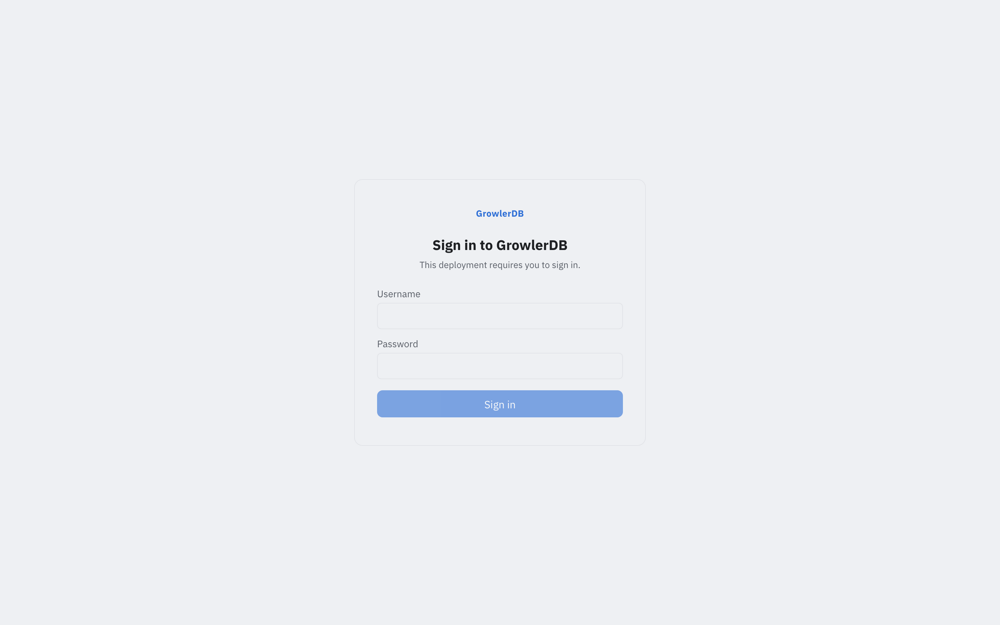
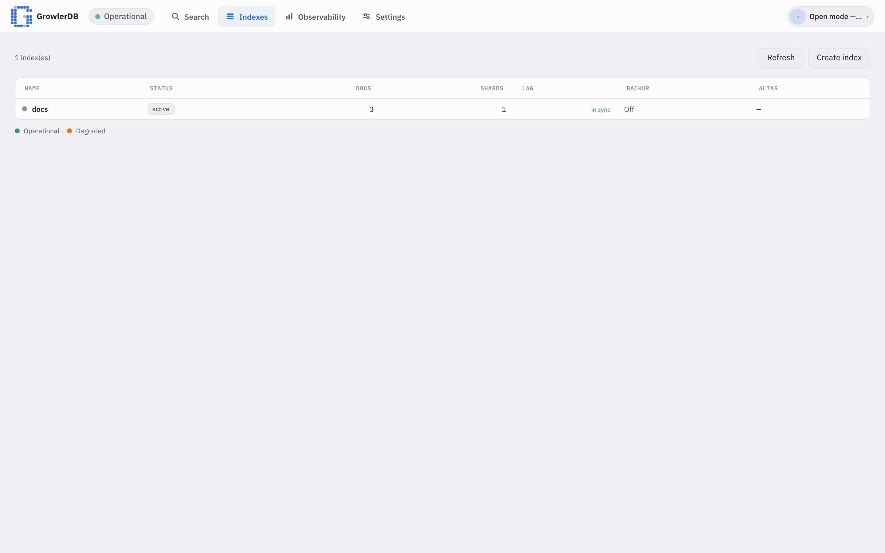
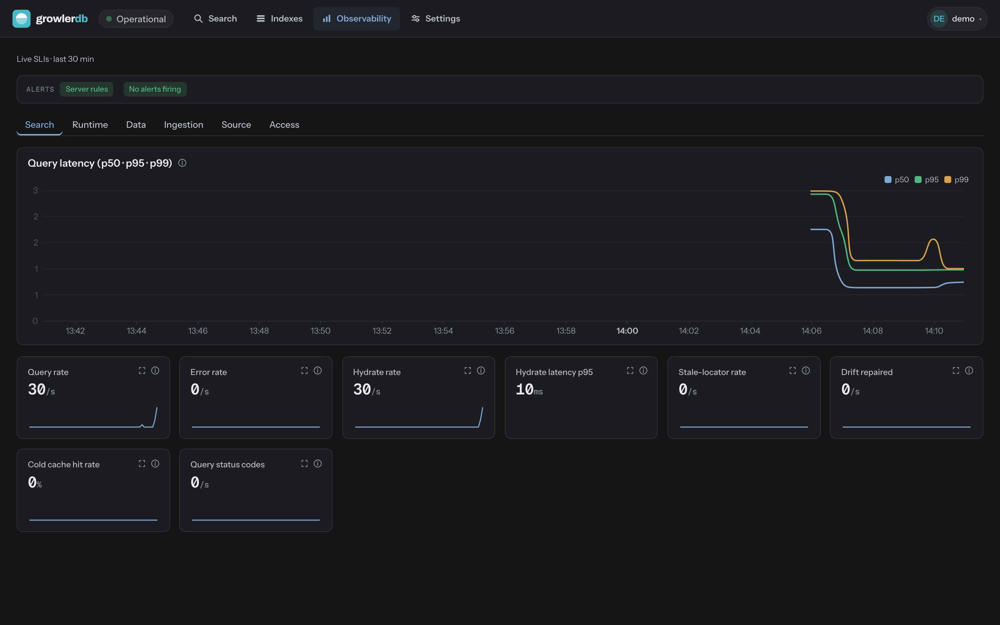

# Getting started

This tutorial guides you through your first search against an Iceberg table, using the local
Compose stack (GrowlerDB, MinIO object storage, the Apache Polaris catalog, and the LGTM
observability stack). It takes a couple of minutes to pull the images and build the sample
indexes (embeddings run on the host CPU); there's no source build on the default path.

## Prerequisites

You need Docker with the Compose v2 plugin, [`just`](https://github.com/casey/just), and `jq` (the
REST examples pipe JSON through it). The whole tutorial runs entirely in containers from prebuilt 
images (the engine and the Spark connector are both pulled), with no host language toolchains 
required. Run it on a Linux host or a VM, or on macOS with Docker Desktop. About 4 GB of RAM is 
enough.

### Ubuntu / Debian

```sh
sudo apt-get update
sudo apt-get install -y docker.io docker-compose-v2 docker-buildx just jq git curl
sudo systemctl enable --now docker
# optional: run docker without sudo (log out/in afterwards)
sudo usermod -aG docker "$USER"
```

### macOS

```sh
brew install --cask docker   # Docker Desktop bundles Compose v2 + buildx; launch it once
brew install just jq
```

## 1. Bring up the full stack

From the repo root:

```sh
just stack
```

This pulls the latest released GrowlerDB image, brings up MinIO and Polaris, and seeds sample Iceberg
tables: `growlerdb.movies` (300 Wikipedia movie plots), `growlerdb.docs` (3 rows),
`growlerdb.catalog` (10 rows), and `growlerdb.events` (an Iceberg v3 variant table; see section 12).
It then starts the control plane, the serving nodes, the gateway, and Grafana/LGTM; each node builds
and serves one or more indexes and registers with the control plane, and the gateway routes each
request to its named index. **The console opens on `movies`**, a `VECTOR` index for semantic and
hybrid search.

> **First run also fetches the local embedding model.** `just stack` provisions bge-small-en-v1.5
> (~130 MB) once into `${GROWLERDB_MODEL_DIR:-~/.cache/growlerdb/models}` on the host and reuses it on
> every later run (and from host `cargo test`/eval). It powers the semantic and hybrid search modes
> (§6): embedding runs in-process on ONNX Runtime, fully local, with no API key. Point
> `GROWLERDB_MODEL_DIR` elsewhere to relocate the cache.

When it settles, the console is at <http://localhost:8081> and Grafana at <http://localhost:3000>.

## 2. Log in

The demo runs authenticated, so you can see GrowlerDB's built-in login and per-index access control.
Open <http://localhost:8081> and you'll get a login form. Sign in with the baked-in demo credential:

| Field | Value |
|---|---|
| Username | `demo` |
| Password | `demo-growlerdb` |



The `demo` user has the reader and operator roles (query and read index metadata; it can't create,
drop, or ingest) and is scoped to the `movies`, `docs`, `catalog`, and `events` indexes, so a token
issued to it can only touch those four (per-index RBAC). Sign-in mints a short-lived session token the
gateway validates on every request.

To call the REST API you need that token. Fetch one from the (unauthenticated) login endpoint and keep
it in a shell variable; the `curl` examples below send it as `-H "authorization: Bearer $TOKEN"`:

```sh
TOKEN=$(curl -s localhost:8081/v1/login -H 'content-type: application/json' \
  -d '{"username":"demo","password":"demo-growlerdb"}' | jq -r .token)
```

## 3. Your first search (REST)

The gateway serves the Engine API at `:8081`. Search returns ranked document coordinates:

```sh
curl -s localhost:8081/v1/search \
  -H 'content-type: application/json' \
  -H "authorization: Bearer $TOKEN" \
  -d '{"index":"docs","query":"title:iceberg","limit":5}'
```

You get the matching keys and scores, with no row contents, just the coordinates:

```json
{
  "hits": [
    { "coordinates": { "identifier": [{ "name": "id", "value": "doc-2" }] }, "score": 0.814 }
  ],
  "total": 1, "shards_scanned": 1, "shards_total": 1
}
```

Now hydrate the authoritative row from Iceberg by that key:

```sh
curl -s localhost:8081/v1/keys:get \
  -H 'content-type: application/json' \
  -H "authorization: Bearer $TOKEN" \
  -d '{"index":"docs","keys":[{"identifier":[{"name":"id","value":"doc-2"}]}]}'
```

```json
{
  "rows": [
    { "key": { "identifier": [{ "name": "id", "value": "doc-2" }] },
      "fields": { "id": "doc-2", "title": "iceberg search",
                  "body": "fast full text search over apache iceberg" } }
  ]
}
```

That round-trip, where search returns coordinates that hydrate to rows from the lake, is the core of
GrowlerDB.

### Inline hydration (one call)

If you prefer a single query for full records, add `"hydrate": true` to your search query:

```sh
curl -s localhost:8081/v1/search \
  -H 'content-type: application/json' \
  -H "authorization: Bearer $TOKEN" \
  -d '{"index":"docs","query":"title:iceberg","limit":5,"hydrate":true}'
```

```json
{
  "hits": [
    {
      "coordinates": { "identifier": [{ "name": "id", "value": "doc-2" }] },
      "score": 0.814,
      "row": {
        "id": "doc-2",
        "title": "iceberg search",
        "body": "fast full text search over apache iceberg"
      }
    }
  ],
  "total": 1, "shards_scanned": 1, "shards_total": 1
}
```

The gateway handles the hydration in the background and returns the authoritative row inline under `hit.row`.

## 4. Explore in the console

Open <http://localhost:8081>. Pick the `catalog` index in the top-left selector, type a query like
`category:(guide OR reference)`, and hit Search. Results come back as a datatable, one row per hit
with its cached fields as columns (author, category, rating, title, views), no drawer round-trip
needed, with matched terms highlighted per cell:


> **Tip:** the top-left selector switches between the `movies`, `docs`, `catalog`, and `events`
> indexes, so pick the one you want to query. In the console's Lucene box a bare word (`search`) queries that index's
> default field, so qualify it with a field, for example `body:search` or `title:iceberg`, to match.
> Click a row to hydrate the full document in the drawer on the right.

- **Search & Explore**: run queries, inspect hits, hydrate rows in the drawer, export JSON/CSV.
- **Indexes**: every index with docs, shards, sync lag, and backup state; Create index points at a
  source table and introspects its schema:

  

- **Observability**: native SLI panels (query rate/errors/latency, hydration, ingestion lag) with a
  health roll-up; the Ingestion tab shows per-index source-head vs. committed-checkpoint lag:

  

## 5. Query playground (the `catalog` index)

The `catalog` index is a 10-row catalog of GrowlerDB concepts with a field of every
type: text (`title`, `body`), keyword (`id`, `category`, `author`), numeric (`views` LONG, `rating`
DOUBLE), a `published` DATE, a `server_ip` IP, and an `archived` BOOL. It's built for trying out the
[query language](reference), and every operator below returns a small, known result.

```sh
curl -s localhost:8081/v1/search \
  -H 'content-type: application/json' \
  -H "authorization: Bearer $TOKEN" \
  -d '{"index":"catalog","query":"body:hydrate","limit":10}'
```

That returns the two rows whose `body` mentions hydrate: `cat-02` and `cat-07`.

### Lucene operators

Each row below is a `query` you can drop into the request above (`{"index":"catalog","query":"…","limit":10}`).
The hits column lists the exact `id`s expected against the seed data.

| # | Operator | `query` | Expected hits (`id`) |
|---|----------|---------|----------------------|
| 1 | Term (field) | `body:iceberg` | cat-01, cat-03 |
| 2 | Default-field term (bare word → `body`) | `hydrate` | cat-02, cat-07 |
| 3 | Phrase | `body:"system of record"` | cat-03 |
| 4 | Keyword term (exact) | `category:reference` | cat-02, cat-05, cat-06 |
| 5 | Set / OR (grouped) | `category:(guide OR reference)` | cat-01, cat-02, cat-05, cat-06, cat-10 |
| 6 | Numeric range (LONG, open upper) | `views:[2000 TO *]` | cat-01, cat-02, cat-05, cat-10 |
| 7 | Float range (DOUBLE, exclusive) | `rating:{4.5 TO 5.0}` | cat-01, cat-02, cat-07, cat-10 |
| 8 | Date range (ISO-date bounds) | `published:[2024-01-01 TO *]` | cat-01, cat-02, cat-04, cat-05, cat-09, cat-10 |
| 9 | CIDR (IP field) | `server_ip:10.0.0.0/8` | cat-01, cat-02, cat-04, cat-06, cat-08, cat-10 |
| 10 | Wildcard | `author:ca*` | cat-03, cat-07, cat-09 (author `carol`) |
| 11 | Prefix (`category:ref*`) | `category:ref*` | cat-02, cat-05, cat-06 |
| 12 | Fuzzy (edit distance 1) | `body:hydrat~1` | cat-02, cat-07 (matches `hydrate`) |
| 13 | Boost (ranking only) | `body:search^2 OR body:iceberg` | cat-01, cat-02, cat-03, cat-07 (search-matching rows ranked higher) |
| 14 | BOOL term | `archived:true` | cat-03, cat-06, cat-08 |
| 15 | NOT / `-` | `-archived:true` | the other 7: cat-01, cat-02, cat-04, cat-05, cat-07, cat-09, cat-10 |
| 16 | Match-all | `*:*` | all 10 rows |
| 17 | Regex (KEYWORD `id`) | `id:/cat-0[12]/` | cat-01, cat-02 |

### KQL

Send `"syntax":"kql"` to use KQL instead of Lucene. The difference is the lowercase `and`, `or`, and
`not` operators (field/range/`*` syntax is the same):

```sh
curl -s localhost:8081/v1/search \
  -H 'content-type: application/json' \
  -H "authorization: Bearer $TOKEN" \
  -d '{"index":"catalog","syntax":"kql","query":"category:guide or category:adr","limit":10}'
```

→ cat-01, cat-09, cat-10 (same as the Lucene `category:guide OR category:adr`). Likewise
`author:carol and not category:concept` → cat-09.

### Sort by a fast field

`views`, `rating`, and `published` are fast fields (columnar), so sort, range, and aggregation use
them. Sort by one instead of relevance:

```sh
curl -s localhost:8081/v1/search \
  -H 'content-type: application/json' \
  -H "authorization: Bearer $TOKEN" \
  -d '{"index":"catalog","query":"*:*","sort":[{"field":"views","desc":true}],"limit":3}'
```

→ the three most-viewed: `cat-01` (4800), `cat-02` (3200), `cat-10` (2750).

In the console, each result row shows the index's `cached` fields (here title, category, author,
rating, views) inline to the right of the primary key, in a lighter font with your query terms
highlighted, so the data is visible without opening the detail drawer.

## 6. Semantic & hybrid search

The `catalog` index carries one field the playground above didn't use: `body_vec`, a `VECTOR` field.
At ingest, GrowlerDB embeds each row's `body` text with the local bge-small-en-v1.5 model (via
ONNX Runtime, in-process) and stores the 384-dim vector, so `catalog` also supports semantic
(nearest-neighbour) and hybrid (lexical plus semantic, fused) retrieval alongside the Lucene/KQL
queries above.

Semantic search embeds your `query_text` the same way and returns the `k` nearest rows, matching on
meaning, so a paraphrase with no shared keywords still hits. The two hydration rows (`cat-02`,
`cat-07`) say "hydrate", never "fetch the original record":

```sh
curl -s localhost:8081/v1/search:semantic \
  -H 'content-type: application/json' \
  -H "authorization: Bearer $TOKEN" \
  -d '{"index":"catalog","vector_field":"body_vec","query_text":"how do I fetch the original record after a query","k":5}'
```

Like `/v1/search`, it returns ranked coordinates (with any `cached` fields); hydrate them with
`keys:get` exactly as in section 3. A lexical `body:"fetch the original record"` matches nothing,
while the semantic arm ranks the hydration rows at the top.

Hybrid search runs a lexical (BM25) arm and a semantic arm over the same `query_text` and
Reciprocal-Rank-Fuses them, so exact keyword hits and semantic near-matches both surface (tune the
fusion constant with `rrf_k`):

```sh
curl -s localhost:8081/v1/search:hybrid \
  -H 'content-type: application/json' \
  -H "authorization: Bearer $TOKEN" \
  -d '{"index":"catalog","vector_field":"body_vec","query_text":"restoring authoritative rows from the lakehouse","k":5}'
```

In the console, the Search screen opens on the `movies` index (a `VECTOR` index): a Lexical /
Semantic / Hybrid mode selector appears (it shows only for an index with a `VECTOR` field) and a **Try
semantic** hint invites you in. Pick Semantic or Hybrid and describe what you want in plain language —
e.g. *a heist that goes wrong* — from the same box; matching rows come back, each with a citation to
its exact Iceberg coordinates. Retrieval lives in one search box that gets smarter — there is no
separate "Ask" screen. GrowlerDB returns governed coordinates and **never calls an LLM**; generating a
prose answer is the caller's job (see §7).

> **Want more to explore?** `just stack` already ships a small (300-film) `movies` index. `just
> demo-data` upgrades it to a larger Wikipedia movie-plots corpus (5000+ films), where the ranking
> differences across semantic / lexical / hybrid are even clearer and agent Q&A (§7) has more to work
> with. See [Demo corpus (movies)](demo-corpus).

## 7. Connect an AI agent (MCP)

GrowlerDB is an MCP server (Model Context Protocol), so an AI agent can use the demo as a retrieval
tool. The gateway serves the MCP Streamable HTTP transport at `POST /mcp` on the same port as the
console and verifies the caller's bearer token on every tool call, so the token's tenant and 
per-index RBAC scoping still applies: the agent only ever sees what `demo` may see.

With the stack up, one command prints everything you need:

```sh
just mcp-connect
```

This command mints a demo token and prints snippets that can be pasted into an agent. There's no 
binary to install and no subprocess to manage, just a URL and a token. If a token expires, re-run
`just mcp-connect` to mint a new one.

If Claude Code is running from the GrowlerDB repo root, it will auto-discover the demo server 
via the repo's checked-in `.mcp.json`. Export the token the script prints:

```sh
export GROWLERDB_DEMO_TOKEN=<token>   # printed by `just mcp-connect`
```

Then start `claude` anywhere in this repo and approve the `growlerdb-demo` server when prompted.

Now ask the agent something the demo data answers, like "what does the catalog say about hydration?",
and it retrieves from `catalog` (semantic, hybrid, or lexical; `search` even hydrates authoritative
rows in the same call with `hydrate: true`), grounded by governed coordinates and citations scoped by
the demo token's RBAC. As everywhere else, GrowlerDB never calls an LLM: it returns the retrieved,
access-controlled source rows, and the agent composes the answer from them. Retrieval with citations
is the product; the model stays yours.

> A stdio transport (`growlerdb mcp`) also exists for environments where the agent can't reach the
> gateway over HTTP. See the
> [MCP interface reference](https://github.com/GrowlerDB/growlerdb/blob/main/okf/product/interfaces/mcp-server.md)
> and `growlerdb mcp --help`.

## 8. Use the OpenSearch adapter (optional)

The stack enables the [OpenSearch-compatible adapter](opensearch-adapter), so OpenSearch clients
work against the same data:

```sh
curl -s localhost:8081/docs/_search \
  -H 'content-type: application/json' \
  -H "authorization: Bearer $TOKEN" \
  -d '{"query":{"match":{"body":"search"}},"size":5}'
```

You get OpenSearch-shaped documents: `_id` from the key, `_source` hydrated from Iceberg:

```json
{
  "hits": {
    "total": { "value": 2, "relation": "eq" },
    "max_score": 0.451,
    "hits": [
      { "_index": "docs", "_id": "doc-2", "_score": 0.451,
        "_source": { "id": "doc-2", "title": "iceberg search",
                     "body": "fast full text search over apache iceberg" } },
      { "_index": "docs", "_id": "doc-3", "_score": 0.451, "_source": { "id": "doc-3", "...": "..." } }
    ]
  },
  "_shards": { "total": 1, "successful": 1, "failed": 0, "skipped": 0 }
}
```

(The doubled `hits.hits` is OpenSearch's own response envelope: the outer `hits` object carries
result metadata and the inner array carries the documents, reproduced verbatim so existing clients
parse it unchanged. GrowlerDB's native `/v1/search` in §3 has no such nesting.)

So an existing OpenSearch/Elasticsearch client can point at GrowlerDB unchanged.

## 9. See the source in Iceberg with Trino (optional)

GrowlerDB keeps Iceberg as the system of record and indexes it. To see that source data directly, and
to compare it with what GrowlerDB returns, bring up Trino (SQL over the same Polaris catalog and MinIO
the seed wrote). It's gated behind the `trino` profile (Trino is a JVM, so it's not in the base
stack):

```sh
docker compose -f deploy/compose/docker-compose.yml --profile trino up -d trino
```

Query the same tables GrowlerDB indexes (`iceberg.<namespace>.<table>`):

```sh
docker compose -f deploy/compose/docker-compose.yml exec trino \
  trino --execute "SELECT id, title, body FROM iceberg.growlerdb.docs ORDER BY id"
```

```
"doc-1","welcome","hello world, welcome to growlerdb"
"doc-2","iceberg search","fast full text search over apache iceberg"
"doc-3","hydration","search returns keys that hydrate authoritative rows"
```

Those are exactly the rows a GrowlerDB search hydrates: `body:iceberg` returns `doc-2` above, and
here you can see the full row in Iceberg. The next section uses this Trino connection to run the full
insert → reindex → search loop.

## 10. The full cycle: add a document, then find it

Iceberg is the source of truth, so a new row starts in the lake and GrowlerDB catches up by
reindexing from source. This section walks the whole loop against the richer `catalog` index
(section 5): insert `cat-11` via Trino SQL, reindex, then search for it.

### Insert a row via Trino

With Trino up (section 9), insert one row into `iceberg.growlerdb.catalog`, a value for every column,
matching the table's types (`views` BIGINT, `rating` DOUBLE, `published` epoch-ms BIGINT, `archived`
BOOLEAN, and the rest VARCHAR):

```sh
docker compose -f deploy/compose/docker-compose.yml exec trino trino --execute \
  "INSERT INTO iceberg.growlerdb.catalog VALUES ('cat-11','Trino Insert Roundtrip','insert a row through trino then reindex growlerdb to make it searchable end to end','tutorial','alice',BIGINT '1234',DOUBLE '4.5',BIGINT '1719792000000','10.0.5.11',false)"
```

`1719792000000` is `2024-07-01` in epoch-milliseconds, matching the Iceberg source table's raw storage representation configured as `format: epoch_ms` (which GrowlerDB automatically scales to its native microsecond resolution during ingestion).
The row is now in Iceberg, and a Trino `SELECT ... WHERE id = 'cat-11'` shows it immediately, but the
`catalog` index doesn't know about it yet. A search for it still returns nothing until we reindex.

### Reindex the `catalog` index (needs the admin token)

GrowlerDB rebuilds an index from its source with `POST /v1/index:reindex {"index":"catalog"}`. This is
an Admin-scoped operation: in [`rbac.rs`](https://github.com/GrowlerDB/growlerdb/blob/main/crates/growlerdb-engine/src/rbac.rs)
`scope_for_method` maps `ReindexIndex → Scope::Admin`, and the `demo` user holds only `reader` and
`operator` (Search, IndexRead, Ops, not Admin). So the demo token can't reindex; it gets a `403`
(`` `ReindexIndex` requires the `admin` scope ``). Use the built-in admin user instead.

The demo stack seeds a built-in `admin` user with a well-known password (`admin-growlerdb`), set via
`GROWLERDB_ADMIN_PASSWORD` in `deploy/compose/docker-compose.yml`, a deliberately well-known demo
credential, not a production account. Log in as `admin` for an admin-scoped token:

```sh
ADMIN_TOKEN=$(curl -s localhost:8081/v1/login -H 'content-type: application/json' \
  -d '{"username":"admin","password":"admin-growlerdb"}' | jq -r .token)
```

Now reindex `catalog` with the admin bearer. GrowlerDB re-reads the Iceberg table (all 11 rows) and
durably swaps the rebuilt index in:

```sh
curl -s localhost:8081/v1/index:reindex -H 'content-type: application/json' \
  -H "authorization: Bearer $ADMIN_TOKEN" -d '{"index":"catalog"}'
```

```json
{ "doc_count": 11, "snapshot": "…" }
```

`doc_count: 11` confirms the new row was picked up.

### Search for the new row

Back with the ordinary demo `$TOKEN` (reader is enough to query), search for a term unique to `cat-11`;
its `body` is the only one mentioning trino:

```sh
curl -s localhost:8081/v1/search \
  -H 'content-type: application/json' \
  -H "authorization: Bearer $TOKEN" \
  -d '{"index":"catalog","query":"body:trino","limit":5}'
```

```json
{ "hits": [ { "coordinates": { "identifier": [{ "name": "id", "value": "cat-11" }] }, "score": 0.9 } ],
  "total": 1, "shards_scanned": 1, "shards_total": 1 }
```

`cat-11` now appears, completing the full insert (Trino) → reindex (from source) → search loop, with
Trino and GrowlerDB reading one source of truth. Hydrate it with `keys:get` (section 3) to see every
column.

## 11. The other sync path: continuous streaming (no reindex)

Section 10 showed the batch path: you insert into the lake, then trigger a full reindex by hand.
That's right for a table that changes occasionally. For a table that changes continuously, you don't
want to reindex on every write: GrowlerDB reads the Iceberg changelog and ingests each new snapshot
incrementally, so rows become searchable on their own. The shipped Spark connector
(`ConnectorApp --stream`) provides exactly-once semantics using node's committed checkpoint.

The `just pipeline` demo wires the whole streaming loop end to end (a generator → Redpanda (Kafka) →
Iceberg → the connector → a live `telemetry_stream` index), so you can watch data flow and search it
as it arrives, with no reindex step. It's a self-contained stack (a different node config than the
`movies`/`docs`/`catalog`/`events` batch demo), so stop the batch stack first:

```sh
just stack-down          # free port 8081 + the node from the batch demo
just pipeline            # deps + Polaris bootstrap + pull the connector image + bring it all up
```

`just pipeline` pulls the connector image (fat jar baked in — no host build) on first run, then starts
the generator, sink, and Spark connector. Give it about 30 s for the first micro-batch to land and the
node to build the `telemetry_stream` index; the gateway comes up once that node is ready.

Tearing down the batch stack likely invalidated your earlier `$TOKEN`. Once the gateway is up, log in 
again for a token that can query it:

```sh
TOKEN=$(curl -s localhost:8081/v1/login -H 'content-type: application/json' \
  -d '{"username":"demo","password":"demo-growlerdb"}' | jq -r .token)
```

Now, without reindexing, search the live index for readings that are still arriving:

```sh
curl -s localhost:8081/v1/search \
  -H 'content-type: application/json' \
  -H "authorization: Bearer $TOKEN" \
  -d '{"index":"telemetry_stream","query":"status:critical","limit":5}'
```

Run it again a few seconds later and `total` climbs: new rows appeared on their own, because the
connector picked up each Iceberg changelog snapshot and ingested it. Watch the same thing on the
console's Observability → Ingestion screen: the per-shard lag (source head − committed checkpoint)
sawtooths up between the connector's 5 s micro-batches and drops as each one commits, and the
`telemetry_stream` doc count on the Indexes screen keeps climbing. Raise the generator's `RATE`
(default 50/s) to push ingest throughput up.

So the two paths, side by side:

| | **Batch** (section 10) | **Streaming** (this section) |
|---|---|---|
| Trigger | manual `POST /v1/index:reindex` | automatic, connector reads the Iceberg changelog |
| Rebuilds | the whole index from source | incremental, only the new snapshots |
| Fits | occasional / bulk changes | continuously-changing tables |
| Demo | `just stack` | `just pipeline` |

Full details + tuning knobs are in [`deploy/compose/pipeline/README.md`](https://github.com/GrowlerDB/growlerdb/blob/main/deploy/compose/pipeline/README.md).
Tear the streaming demo down with `just pipeline-down`.

## 12. Iceberg v3 variant search (the `events` index)

`just stack` also serves **`events`**, an Apache Iceberg **v3 `variant`** table
(`growlerdb.events`, GitHub-events shaped): scalar `id`/`ts`/`event_type` columns plus a
semi-structured `payload` variant whose shape differs per row. A variant column has no fixed leaf
schema, so GrowlerDB maps it two composable ways ([variant fields](https://github.com/GrowlerDB/growlerdb/blob/main/okf/product/functional/index-management/variant.md)):

- **Flatten** — every leaf is indexed untyped as an exact `path = value` term, plus an analyzed
  full-text catch-all over string leaves. No declaration needed; covers the whole value.
- **Shapes** — named typed sub-mappings (`payload.number` LONG, `payload.title` TEXT + a VECTOR,
  …) selected per row by a **discriminator** (`event_type`), giving ranges/sorts/hybrid on declared
  paths. See [`deploy/compose/events.yaml`](https://github.com/GrowlerDB/growlerdb/blob/main/deploy/compose/events.yaml).

Because released iceberg-rust can't yet scan a v3 variant table, `events` is **connector-fed** (its
rows are extracted by the Spark connector) and **hydrated through Trino** — transparently; you query
it exactly like any other index. Reusing the `$TOKEN` from section 2:

```sh
# Flatten term on an UNDECLARED path (works with no mapping):
curl -s localhost:8081/v1/search -H "authorization: Bearer $TOKEN" -H 'content-type: application/json' \
  -d '{"index":"events","query":"payload.user.login:octocat"}' | jq '.hits[].coordinates'

# Full-text over the flatten catch-all:
curl -s localhost:8081/v1/search -H "authorization: Bearer $TOKEN" -H 'content-type: application/json' \
  -d '{"index":"events","query":"payload:variant"}' | jq '.total'

# Range + exact on typed SHAPE paths (LONG / KEYWORD / BOOL):
curl -s localhost:8081/v1/search -H "authorization: Bearer $TOKEN" -H 'content-type: application/json' \
  -d '{"index":"events","query":"payload.number:[1000 TO 2000]","sort":[{"field":"payload.number","desc":true}]}' | jq '.hits[].coordinates'

# Hydrate a hit — the whole variant comes back as JSON (fetched via Trino):
curl -s localhost:8081/v1/search -H "authorization: Bearer $TOKEN" -H 'content-type: application/json' \
  -d '{"index":"events","query":"payload.number:1347","hydrate":true}' | jq '.hits[0].row.payload'

# Hybrid (lexical + vector) over the shaped VECTOR `payload.title_vec`:
curl -s localhost:8081/v1/search:hybrid -H "authorization: Bearer $TOKEN" -H 'content-type: application/json' \
  -d '{"index":"events","vector_field":"payload.title_vec","query_text":"connect the SQL query engine","k":3}' | jq '.hits[].coordinates'
```

A row whose `event_type` matches no declared shape (e.g. a `WatchEvent`) is still fully
flatten-covered — you'll find it by `payload.*` term — but has no typed shape fields.

## 13. Tear down

```sh
just stack-down
```

## Troubleshooting

- **First `just stack` is slow (~10 min).** It compiles the GrowlerDB image once; subsequent starts
  reuse the cached image and take seconds.
- **Search returns `0 results` in the console.** Select the right index (`movies`, `docs`, `catalog`,
  or `events`, top-left) and qualify the term with a field, `body:search`, not a bare `search` (a bare
  term only matches the default field).
- **REST search/`keys:get` returns `index required; endpoint serves 4 indexes`.** The stack serves
  four indexes, so the gateway can't pick a default; add `"index":"movies"`, `"index":"docs"`,
  `"index":"catalog"`, or `"index":"events"` to the request body. (The console lands on `movies` via
  `/v1/config`, but that default doesn't apply to the REST API.)
- **Reading MinIO directly from the host fails** (`nodename nor servname` / connection refused): this
  hits only *direct* host-side object-storage reads — client-side hydration with your own S3 client, or
  the host test suite — not `keys:get`/`hydrate` through the gateway, which hydrate server-side. Add the
  `127.0.0.1 minio` `/etc/hosts` entry (see *Optional: read the Compose MinIO directly from your host*
  in Prerequisites).
- **Ports already in use** (`8081`, `3000`, `9000`): stop the conflicting service or `just stack-down`
  a previous run first.
- **Console shows "Unknown"/degraded health right after start:** the node is still building the `docs`
  index from the table; give it a few seconds and refresh.

## Where to next

- **[Connect your own Iceberg table](external-iceberg)**: run Compose against your own external table
  on S3 (real AWS S3 or an in-house lakehouse), including the connector setup.
- **Add semantic search to your own index**: declare a `VECTOR` field over a text column (see the
  [index definition reference](configuration#field-types)); embeddings are produced locally at ingest.
  Then point an AI agent at it over MCP (§7) for grounded, RBAC-scoped retrieval.
- Index your own table: define an index over its columns + key, drop the [index definition](reference)
  in via the console's Indexes → Create (it introspects your source schema).
- [Migrate from Elasticsearch/OpenSearch](migration-from-elasticsearch).
- [Deploy on Kubernetes](https://github.com/GrowlerDB/growlerdb/blob/main/deploy/helm/growlerdb/README.md).
