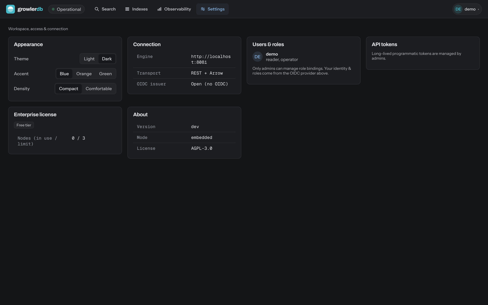

# GrowlerDB console (UI)

A **Svelte SPA** (Vite + TypeScript) that is a _pure client_ of the Engine API — the human surface
over the same gRPC/REST API programmatic callers use. It never reaches the index or storage directly;
the [gateway](../okf/product/interfaces/ui.md) serves it at the same origin as the REST API. Themed by
[Brand v1.0](../BRAND.md) (dark-first; Archivo / Instrument Sans / Geist Mono).


## Screens

- **Search / Explore** — Lucene/KQL query, faceted refinement, sort + keyset paging, per-hit BM25
  explain, highlighted matches, hydrate a row in the drawer, saved queries, and JSON/CSV export.
- **Indexes** — every index with docs / shards / sync lag / backup / alias; **Create index** points at
  a source table and introspects its schema; per-index detail does reindex / alter / compact / backup /
  drop + alias management.
- **Observability** — live SLI panels (query rate·errors·latency, hydration, ingestion lag, cold-cache),
  a health roll-up, and server-side alert state; deep dashboards link to Grafana.
- **Settings** — appearance (theme·accent·density), connection, identity + roles, API tokens, the
  Enterprise-license card, and About.
- **Login gate** — shown in closed mode (built-in credential or OIDC) when unauthenticated.




## Layout

- `src/App.svelte` — the topbar/nav shell (brand lockup, health pill, account menu; skip link,
  keyboard-navigable nav, `main` landmark).
- `src/routes/` — the screen components (Search, Indexes, IndexDetail, Observability, Settings) + the
  hydrate drawer.
- `src/app.css` — the design-system tokens (Brand v1.0 palette + type), theme/accent/density knobs.
- `src/lib/auth.ts` — OIDC **authorization-code + PKCE** login; forwards the bearer token.
- `src/lib/api.ts` — Engine API client; attaches `Authorization: Bearer <token>`.
- `src/lib/i18n.ts` + `src/lib/locales/` — message catalog + `t()`; **no hardcoded strings**.
- `src/lib/router.ts` — tiny path router (the Engine serves `index.html` as the SPA fallback).
- `src/lib/config.ts` — optional OIDC config from `VITE_OIDC_*` or `window.__GROWLERDB_CONFIG__`.

## Develop

```sh
just ui-install   # once
just ui-dev       # Vite dev server (HMR)
just ui-check     # svelte-check + vitest
just ui-build     # production build → dist/
```

## Test

Two layers, both run in CI (the `ui` job):

```sh
npm run check     # svelte-check (types + a11y)
npm test          # vitest unit tests for the pure lib/ modules
npm run e2e        # Playwright screen-level E2E
```

The **E2E** lives in `e2e/` and is **fully mocked at the network layer** (`e2e/mocks.ts`
intercepts `**/v1/**`), so it needs **no live Engine or stack** — fast and deterministic. It
builds + previews the real production bundle (see `playwright.config.ts`) and covers the primary
flows (search → hydrate, create-index-from-introspection, ingestion, observability) plus the
empty / error / partial-results states.

First run, install the browser once: `npx playwright install chromium` (CI uses
`--with-deps`). To debug: `npm run e2e -- --headed` or `--ui`.

## Served by the Engine

The Engine binary serves the built SPA: `growlerdb serve … --ui-dir ui/dist` (or
`--ui-dir` on `gateway`, or `GROWLERDB_UI_DIR`). Static assets are served directly and any
non-`/v1` path falls back to `index.html` (client-side routing); the `/v1` API takes precedence.

## Config

- `VITE_ENGINE_API` — Engine API base URL (default empty = same origin; the Engine serves the UI).
- `VITE_OIDC_ISSUER` / `VITE_OIDC_CLIENT_ID` / `VITE_OIDC_REDIRECT_URI` / `VITE_OIDC_SCOPE` — OIDC.
  With no issuer the UI runs against an open Engine (mirrors the gateway, open until `--oidc-issuer`).
